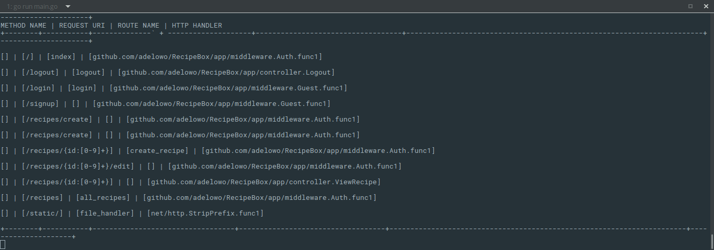

## Muxlist

[](https://travis-ci.org/adelowo/muxlist.svg?branch=master)

> It's like a route debugger for `Gorilla/Mux` or your favorite router.


Coming from PHP, web frameworks i use usually have a command to view the registered routes. Since i am used to that, i decided to do something for `gorrila/mux` since i use it quite a bit.



### Usage

```go 

    r := mux.NewRouter()

	r.Handle("/", index).Methods("GET")

	r.HandleFunc("/logout", logout).Methods("GET")

	r.Handle("/login", login).Methods("GET", "POST")

	r.Handle("/signup", signup).Methods("GET", "POST")

	r.Handle("/recipes/create", addRecipe).Methods("GET")

	muxlist.NewMuxLister(muxlist.NewGorillaMuxLister(r)).Table()

```

> Naturally, you should only run this in development, so you'd have something like `if development { ... }`


> The methods for the routes are currently not available since there is still a pending PR for that in `gorrila/mux`. But i'd get it in as soon as it gets merged in

This currently works for `gorrila/mux` but could be extended to work for any other multiplexer. All that is needed is a struct that satisfies `Extractor`.

`Extractor` looks like :

```go

type Extractor interface {
	Extract() ResultSet
	List() string
}

```

Then register it with 

```go

muxlist.NewMuxLister(muxlist.NewLister())
muxlist.Table()


```

### LICENSE

MIT
